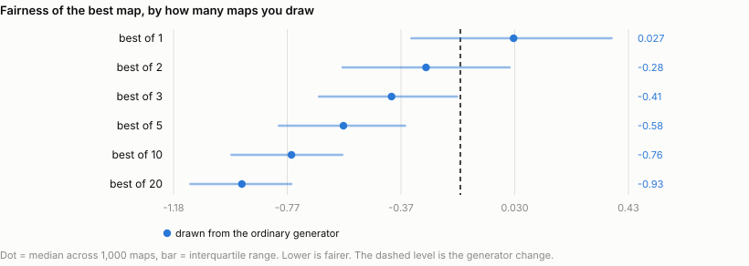
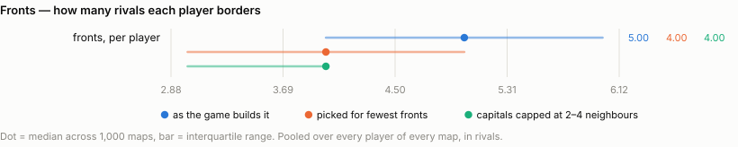
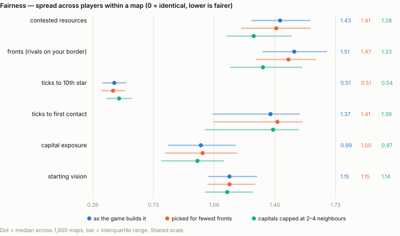
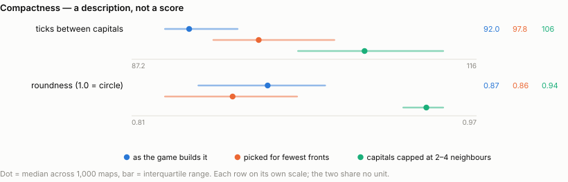
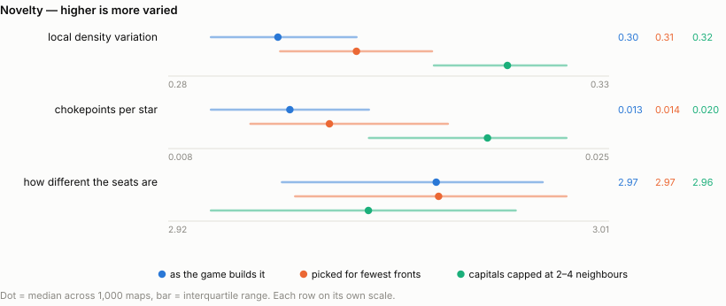
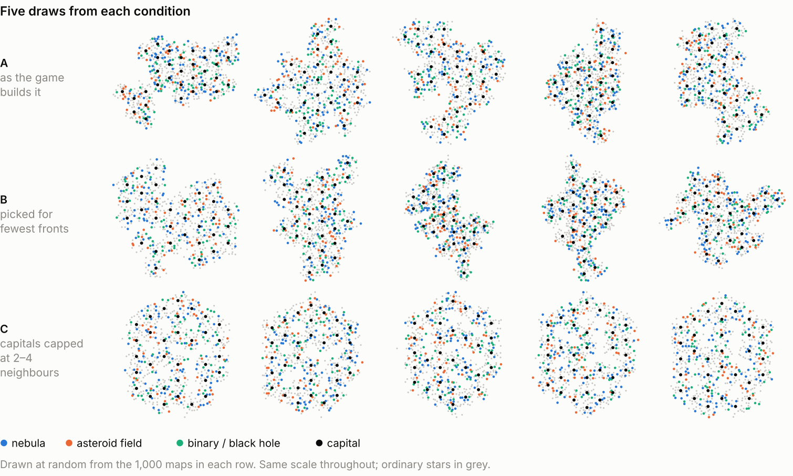

# Fronts and Fairness

**How fair is a 32-player Solaris galaxy, and what actually makes it fairer?**

I generated 8,000 thirty-two-player irregular galaxies using the game's own 32-player settings, measured each one, and compared three ways of getting a better map. Every number below is a **median across 1,000 maps, with the middle half of them in brackets** — the range you would actually land in, not an average that hides the spread.

---

## Finding 1 · Two maps beat a better generator

Every galaxy is a roll of the dice. Some seat you with a single neighbour and a quiet corner; some drop you in the middle of a dozen rivals. You can attack that by improving the generator, or by generating a few galaxies and keeping the fairest one.

The index combines all six fairness measures into one number; lower is fairer, and 0 is a typical unfiltered map.

| how you pick the map | fairness index [middle half] |
| :--- | ---: |
| take the first one you get | +0.027 [-0.335 to +0.373] |
| **redesign the generator** (arm C) | **-0.162 [-0.527 to +0.205]** |
| draw 2, keep the fairer | -0.283 [-0.578 to +0.013] |
| draw 3, keep the fairest | -0.405 [-0.662 to -0.173] |
| draw 5, keep the fairest | -0.575 [-0.804 to -0.357] |
| draw 20, keep the fairest | -0.934 [-1.116 to -0.759] |

Drawing **two** maps and keeping the fairer already beats the generator redesign. Drawing twenty gets you five times as far. Generating a galaxy takes about a second, so this is the cheapest game design choice available by a wide margin.

---

## Finding 2 · Not every player can be put on 2–5 fronts

A **front** is a rival whose territory touches yours — how many directions you can be attacked from. Asking that every player get between 2 and 5 of them is a reasonable-sounding request, and it is very nearly satisfiable.

Very nearly, but not quite. **Of 8,000 galaxies, none put all 32 players inside 2–5 fronts.** The closest came within 2 players of it, and 66 maps in 8,000 got within five. Arm B below is the 1,000 that came closest. Most produce fronts between 1-6.

|  | typical player | seats inside 2–5 |
| :--- | ---: | ---: |
| **A** · as the game builds it | 5 fronts | 61% |
| **B** · picked for fewest fronts | 4 fronts | 76% |
| **C** · capitals capped at 2–4 neighbours | 4 fronts | 90% |

Note what arm C does here without any selection at all: capping capital neighbours puts 90% of seats inside the target band, against 61% in an ordinary galaxy and 76% even after picking the best 1,000 maps out of 8,000.

---

## Finding 3 · Picking for fewer fronts does not make a map fairer

This is the part that surprised me. Selecting maps for low front counts changes the **level** — the typical player goes from 5 borders to 4 — but it barely touches the **inequality**. Arm B's fronts spread is 1.47 against arm A's 1.51: a shift of 0.03 against a middle half that is 0.35 wide. Contested ground moves no further (1.41 against 1.43). The seats stay about as unequal as they were; they are all simply a little smaller.

Changing the generator does both. Arm C is fairer on fronts (1.33 against 1.51) and on contested ground (1.28 against 1.43), *and* it is more varied — which is the trade-off you would normally expect to have to pay for fairness, and here you do not.

A spread is the gap between the best-off and worst-off player divided by the average, so 0 would mean every player got exactly the same and lower is fairer.

---

## Compactness

How much room the galaxy takes up, and how far apart it puts people. A description rather than a score: neither direction is better.

Capping capital neighbours spreads the galaxy out — the typical pair of capitals goes from 92 to 106 ticks apart — and makes the outline rounder (0.87 to 0.94, where 1.0 is a circle).

---

## Novelty

Whether the galaxy is interesting to play: does its density vary, is there ground worth defending, are the seats meaningfully different.

**Chokepoints per star** is the number to watch and it is low everywhere. In an ordinary galaxy it is 0.013 — about one star in 80. At hyperspace 2 you can jump 175 units, and the stars sit close enough together that nearly every route has an alternative, so very little ground is worth holding for its position. Capping capital neighbours raises it by about 1.6×, to 0.020. Still low, but it is the only lever here that moves it at all.

---

## What the galaxies look like

Rows A and B are the same generator, so the family resemblance is expected — row B is simply the subset with the lowest front counts. Row C is visibly different: rounder, more evenly filled, with the capitals holding each other at arm's length.

---

## Appendix

### How to read the numbers

Every value in this write-up is a **median across the 1,000 maps in an arm, with the middle half of those maps in brackets**. So `1.43 [1.27–1.59]` means half the maps you generate land between 1.27 and 1.59, and the middle one is 1.43. The bracket is not an error bar and it does not shrink if I generate more maps — it is how much galaxies genuinely differ from each other, which is the thing you are subject to when you generate exactly one.

The six fairness measures are reported as a **spread**: the gap between the best-off and the worst-off player, divided by the average of all 32.

| spread | roughly means |
| :--- | :--- |
| 0 | every player got exactly the same |
| 0.35 | the best seat has about 1.5× what the worst seat has |
| 1.25 | about 4× |
| 1.8 | about 6× |

A spread says nothing about whether the map is rich or poor, only whether it treats players alike. It also cannot tell you whether the worst-off player has a little or has nothing, which is why the table after next gives the raw worst / typical / best values in their own units.

### What each measure means

**Fairness — six measures, each reported as a spread across the 32 players.**

| measure | what it counts | how to read it |
| :--- | :--- | :--- |
| contested resources | the resources sitting on neutral stars that both you and at least one rival can reach within 40 ticks | The prize you have to fight for, as opposed to the prize you are handed. A player with none has no reason to leave home; a player surrounded by it has no safe ground. **Zero is not a low score, it is a broken seat** — it means no neutral star is reachable by both you and any rival. |
| fronts | how many rivals' territory touches yours | How many directions you can be attacked from. Territory is worked out by travel time: every star belongs to whoever can get a carrier to it soonest from their starting stars, and two players share a front when a star of one sits within a single jump of a star of the other. A typical seat borders 5 rivals; 1 is a quiet corner and 12 is a nightmare. |
| ticks to 10th star | travel time from your whole starting group to the 10th nearest unowned star | Expansion speed, and it compounds — a player slower to their tenth star is behind on economy for the rest of the game and the gap widens. Measured from all six of your starting stars, not just the capital. |
| ticks to first contact | travel time until you can reach any star a rival begins with | When the shooting can start. Being reachable on tick 8 while a rival is safe until tick 40 is a handicap set before anyone moves. |
| capital exposure | travel time for the nearest rival to reach *your* capital | The same question aimed at the one star whose loss ends your game in the elimination modes. Measured towards you, so this is the one fairness measure where **a bigger number is better for you**. |
| starting vision | how many stars you can see from your starting group on turn one | Solaris has fog, so this is how much of the map you begin knowing. Counted per star rather than at one flat radius, because terrain changes scanning range — a black hole sees three levels further than an ordinary star. |

**Compactness — two measures, one value per map. Neither has a better direction; they describe the galaxy rather than score it.**

| measure | what it counts | how to read it |
| :--- | :--- | :--- |
| ticks between capitals | the median travel time between every pair of capitals | How much room the galaxy actually occupies, in the units the game cares about. Lower is a tighter galaxy where everyone is in reach of everyone. |
| roundness | the shape of the galaxy's outline, as `4π × area ÷ perimeter²` | 1.0 is a perfect circle and a square scores 0.785. Lower means long, stringy or ragged. Independent of size, so it separates "a bigger galaxy" from "a differently shaped one". |

**Novelty — three measures, one value per map. Higher is more varied.**

| measure | what it counts | how to read it |
| :--- | :--- | :--- |
| local density variation | how much star density varies from place to place across the galaxy | 0 would be a perfectly even field with no places in it. 0.33 means a typical neighbourhood is about a third denser or sparser than average. Higher means the galaxy has regions rather than being uniform mush. |
| chokepoints per star | the share of stars whose loss would cut a region off from the rest | 0.25 would mean one star in four is worth holding for its position alone. Measured at the jump range players actually start with, because the question is how redundant the routes are at the range people can currently fly. Low numbers mean there is nothing to defend. |
| how different the seats are | how differently the 32 players are placed relative to one another, across five of the fairness quantities at once | 0 means every player is in an identical position — which is exactly what a rotationally symmetric map scores by construction. Higher means genuinely different seats. **It does not say whether the differences are fair**; that is what the six spreads are for. The goal is a map that is high here and low on the spreads: players facing different problems of equal difficulty. |

**The fairness index** used in Finding 1 is not one of the eleven. It is the average of the six fairness spreads after putting each on a common scale, signed so lower is fairer, and it exists only to rank maps against each other in the selection experiment. It is deliberately not reported as a measure anywhere else, because averaging six things that trade against each other hides which one moved.

### All eleven measures

Median across the 1,000 maps in each arm, with the middle half in brackets.

| measure | A · as the game builds it | B · picked for fewest fronts | C · capitals capped at 2–4 neighbours |
| :--- | ---: | ---: | ---: |
| **Fairness — spread across players** |  |  |  |
| contested resources | 1.43 [1.27–1.59] | 1.41 [1.22–1.59] | 1.28 [1.14–1.49] |
| fronts (rivals on your border) | 1.51 [1.33–1.68] | 1.47 [1.30–1.62] | 1.33 [1.16–1.55] |
| ticks to 10th star | 0.51 [0.45–0.58] | 0.51 [0.44–0.57] | 0.54 [0.47–0.61] |
| ticks to first contact | 1.37 [1.06–1.53] | 1.41 [1.06–1.55] | 1.39 [1.02–1.53] |
| capital exposure | 0.99 [0.81–1.18] | 1.00 [0.80–1.19] | 0.97 [0.78–1.12] |
| starting vision | 1.15 [1.04–1.30] | 1.15 [1.03–1.29] | 1.14 [1.02–1.28] |
| **Compactness — no better direction** |  |  |  |
| ticks between capitals | 92 [90–96] | 98 [94–104] | 106 [101–113] |
| roundness (1.0 = circle) | 0.87 [0.84–0.90] | 0.86 [0.82–0.88] | 0.94 [0.93–0.95] |
| **Novelty — higher is more varied** |  |  |  |
| local density variation | 0.30 [0.29–0.31] | 0.31 [0.30–0.31] | 0.32 [0.31–0.33] |
| chokepoints per star | 0.013 [0.009–0.016] | 0.014 [0.011–0.019] | 0.020 [0.016–0.023] |
| how different the seats are | 2.97 [2.94–2.99] | 2.97 [2.95–3.00] | 2.96 [2.93–2.99] |

### What the worst-off player actually gets

A spread cannot tell you whether the worst-off player has a little or nothing at all. Worst / typical / best player, pooled across every map in the arm.

| measure | unit | A · as the game builds it | B · picked for fewest fronts | C · capitals capped at 2–4 neighbours |
| :--- | :--- | ---: | ---: | ---: |
| contested resources | resources | 294 / 3583 / 10899 | 79 / 3372 / 10152 | 645 / 2926 / 9347 |
| fronts (rivals on your border) | rival players | 0.0 / 5.0 / 14.0 | 0.0 / 4.0 / 12.0 | 1.0 / 4.0 / 12.0 |
| ticks to 10th star | ticks | 8.0 / 16.0 / 32.0 | 9.0 / 16.0 / 30.0 | 9.0 / 16.0 / 32.0 |
| ticks to first contact | ticks | 1.0 / 24.0 / 56.0 | 1.0 / 24.0 / 68.0 | 1.0 / 24.0 / 47.0 |
| capital exposure | ticks | 1.0 / 35.0 / 70.0 | 1.0 / 35.0 / 77.0 | 1.0 / 35.0 / 54.0 |
| starting vision | stars | 6.0 / 17.0 / 50.0 | 6.0 / 16.0 / 49.0 | 5.0 / 15.0 / 41.0 |

### The three arms

|  | how the galaxy is made | how it is chosen |
| :--- | :--- | :--- |
| **A** · as the game builds it | the game's irregular generator, unmodified | the first 1,000 of 8,000 draws |
| **B** · picked for fewest fronts | the same generator | the 1,000 of 8,000 closest to 2–4 fronts |
| **C** · capitals capped at 2–4 neighbours | capitals carved so each has 2–4 neighbouring capitals | 1,000 draws, unselected |

All three use the game's published 32-player setup: 32 players, 640 stars, six starting stars each, hyperspace 2 and scanning 3 at the start.

### Method

Galaxies were built to match the game's own behaviour rather than this repository's map builder, which adds a fairness layer the game does not have. That means uniform random star resources with no distance weighting, terrain scattered one star at a time and never evened out, no separation cleanup, and no build-time balance checks. Only the capital gets fixed resources, so **starting positions in a real game are not identical** — total starting resources varied by roughly 40% between the best and worst seat.

The fairness index in Finding 1 is the average of the six fairness spreads after standardising each one, signed so lower is fairer. It exists to rank maps for the selection experiment and is not reported as a measure anywhere else, because averaging six things that trade against each other hides which one moved.

### Caveats

- **Fronts is measured at the jump range players start with.** An earlier version of this study measured borders on whatever jump range finally connects the galaxy, which on a badly connected map is hyperspace 8 — a 475-unit jump against the 175 players actually have. That counted territories two and three regions apart as touching and inflated front counts to as many as 20. The other ten measures were checked for the same fault and none of them has it.
- **94% of galaxies are not one connected piece at the starting jump range.** This is normal for this generator — the voids are the point — and travel times are measured at the range where the galaxy does join up.
- **Arm B is a selection, not a guarantee.** No map satisfies the 2–5 band outright, so arm B is the closest 1,000 available. Even the best map in the run leaves 2 of its 32 players outside.